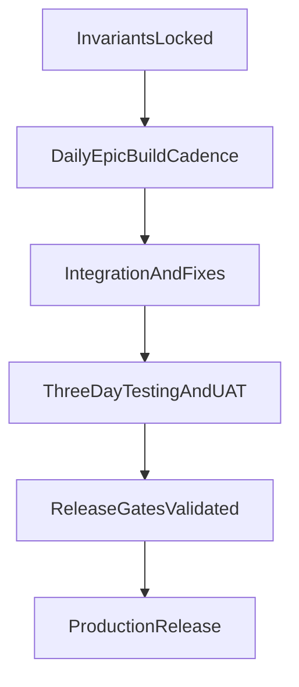

# CadetFlow 2026 — Priority Implementation Plan

This plan replaces the prior phase-heavy implementation narrative with a delivery-first plan for the next two weeks of feature work plus three days for testing and rollout.

This document is constrained by `invariants.md`. If any item conflicts with an invariant, the invariant wins.

---

## 1) Scope and Delivery Window

- **Build window:** 2 weeks, targeting roughly one epic per day.
- **Stabilization window:** final 3 days dedicated to testing, UAT, and rollout.
- **Primary goal:** ship the highest-priority operational feature set for school-year readiness without compromising security, RLS behavior, historical integrity, or admin usability.

---

## 2) Major Oversights in Prior Plan (Now First-Class)

These high-impact items were under-scoped or missing in the original docs and are now explicit workstreams:

1. **Cadet Oversight Assignments**
   - Big-3 adult model (teachers, in-season coach, TAC) with automatic updates on term/season/company changes.
   - Additional faculty assignment model for cadet-specific oversight.

2. **Comprehensive Notification Coverage**
   - In-app notifications were not fully specified as a user-facing system.
   - Full event matrix now required for cadet, submitter, staff-assigned, and parent audiences.

3. **Expanded Preference Model**
   - Existing email settings are insufficient for planned notification fan-out.
   - Per-cadet preferences must be introduced and enforced by dispatch logic.

4. **RLS Hardening Gaps**
   - Non-RLS-safe paths, especially around `demerit_reports`, must be corrected so strict RLS can remain enabled.

5. **School-Year Archival and Multi-Year Navigation**
   - Missing complete lifecycle for graduating/non-returning cadets and returning cadet historical view switching.

6. **Facilities Operations Features**
   - Work orders, room status, and TAC hallway view were not represented in operational detail.

7. **Historical Conduct Analytics**
   - Conduct-level tracking needed to persist and query by prior terms, not only current term calculations.

8. **Summary Generation Workflow**
   - TAC-reviewed monthly/term summaries for parent communication were underspecified.

9. **Role-Configurable Stick Category Limits**
   - Cadet category restrictions must be policy-configurable at school-admin level.

10. **Special Reports System**
    - Affidavit-like Special Reports require dedicated submission and review/action interfaces.

11. **Parent Onboarding and Portal Flow**
    - Secure TAC-generated invite links, linked parent accounts, and scoped parent capabilities were not fully defined in execution order.

---

## 3) Execution Sequence (2 Weeks + 3 Days)

The table below is dependency-aware and optimized for daily deliverables.

| Day | Epic | Outcome |
|---|---|---|
| 1 | **RLS/Policy Hardening Baseline** | RLS-safe report paths and policy map established |
| 2 | **Big-3 Assignment Engine** | Auto-managed core adult assignments + extra faculty links |
| 3 | **Notification Event Model + In-App Foundation** | Event taxonomy and in-app inbox baseline |
| 4 | **Email Expansion + Preference Controls** | End-to-end email events with user/per-cadet preferences |
| 5 | **Role-Based Category Restrictions** | Cadet stick-category limits configurable by admin |
| 6 | **Year Archival + Returner Lifecycle** | Bulk archive workflows for year/cadet states |
| 7 | **Multi-Year Ledger/Profile Switching** | Year selector and historical conduct views |
| 8 | **Work Orders Intake + TAC Triage** | Student submissions and TAC handling workflow |
| 9 | **Room Status + Hallway View** | TAC hallway visualization and print-ready roster |
| 10 | **Special Reports Module** | Submission, event linkage, review, summary, actioning |
| 11 | **Parent Invite + Linked Parent Portal** | Secure invite flow and parent-scoped capabilities |
| 12 | **Monthly/Term Summary Workflow** | Auto-generated summary drafts with TAC review/forward |
| 13-15 | **Testing, UAT, Rollout** | Regression, verification, go/no-go, production launch |

---

## 4) Epic Details (Objective, Build Targets, Acceptance)

Each epic includes a daily definition of done. Daily completion means accepted criteria are met in staging.

### Epic 1 — RLS/Policy Hardening Baseline

**Objective**
- Ensure non-RLS-safe paths are corrected so strict RLS can remain enabled across core report lifecycle tables.

**Build Targets**
- Produce table-by-table RLS audit matrix for high-risk tables.
- Refactor report approval/update flows to function under policy constraints.
- Remove legacy bypass assumptions in RPC/action paths.

**Acceptance**
- Core demerit report lifecycle works with RLS on.
- Unauthorized reads/writes are denied in staging.
- Policy matrix checked into docs.

### Epic 2 — Big-3 Assignment Engine + Extended Faculty Assignment

**Objective**
- Auto-attach teachers, in-season coach, and TAC per cadet; support additional faculty assignments.

**Build Targets**
- Assignment derivation from term/season/company sources.
- Support both system-derived and manually assigned oversight relationships.
- Assignment-change events emitted for notifications.

**Acceptance**
- Big-3 assignments update automatically when source inputs change.
- Additional faculty assignment supports add/remove and audit logging.

### Epic 3 — Notification Event Model + In-App Foundation

**Objective**
- Create canonical event taxonomy and in-app notification pipeline.

**Build Targets**
- Event types: action against cadet, report actioned, ED placement, conduct-level drop, assignment-scope events.
- In-app notification creation/read status and user feed.

**Acceptance**
- Events route to correct audience types in-app.
- No duplicate in-app notifications for the same event idempotency key.

### Epic 4 — Email Expansion + User/Per-Cadet Preferences

**Objective**
- Expand email system to mirror required event coverage and preference behavior.

**Build Targets**
- Email mapping for all required event types.
- Preference hierarchy: global -> user -> per-cadet.
- Preference management controls in settings UI.

**Acceptance**
- Emails fire for enabled preferences and suppress for disabled preferences.
- Per-cadet preference behavior verified for staff oversight users.

### Epic 5 — Role-Based Category Restrictions (Admin-Configurable)

**Objective**
- Enforce configurable category restrictions by actor role (default: cadets category 1 only).

**Build Targets**
- School-level policy control for submission category permissions.
- Enforcement in server path and UX constraints in form flow.

**Acceptance**
- Cadet cannot submit restricted categories unless policy allows.
- TAC/admin paths continue functioning for categories 2/3.

### Epic 6 — Year Archival + Returner Lifecycle

**Objective**
- Bulk archive graduating/non-returning cadets and close out year data.

**Build Targets**
- Bulk archive operations with safety checks and audit.
- Returner lifecycle model preserving historical records.

**Acceptance**
- Archive operation is reversible/traceable as defined by invariants.
- Returning cadets retain historical-year data continuity.

### Epic 7 — Multi-Year Profile/Ledger Switching + Conduct History

**Objective**
- Enable historical navigation of cadet profile and ledger by school year/term.

**Build Targets**
- Year selector in profile/ledger surfaces.
- Term-end conduct snapshots stored and queryable.

**Acceptance**
- Users can switch years on-the-fly for returners.
- Conduct-level lists can be queried for non-current terms.

### Epic 8 — Work Orders Intake + TAC Triage

**Objective**
- Add student-to-TAC work request flow for rooms/shared spaces.

**Build Targets**
- Work request submission form.
- TAC triage queue with status transitions.
- Hand-off mechanism for external maintenance email/portal.

**Acceptance**
- Students can submit requests and track status.
- TAC can process and forward requests with audit trail.

### Epic 9 — Room Status + TAC Hallway View

**Objective**
- Add hallway-oriented occupancy view and print-ready TAC sheet.

**Build Targets**
- Hallway model and room occupancy mapping.
- Hotel-style hallway visualization.
- Print format optimized for TAC reference.

**Acceptance**
- TAC can filter by hallway and print clean roster reference.
- Room assignment updates propagate to hallway view.

### Epic 10 — Special Reports Module

**Objective**
- Introduce affidavit-like Special Reports with review and action workflows.

**Build Targets**
- Cadet submission interface for Special Reports.
- Admin/TAC review panel with event assignment and summaries.
- Action outcomes linked to discipline events where applicable.

**Acceptance**
- Special Reports are searchable, assignable, and action-traceable.
- Review notes and outcomes are audited.

### Epic 11 — Parent Invite + Linked Parent Portal Baseline

**Objective**
- Enable secure parent onboarding and cadet-linked parent features.

**Build Targets**
- TAC-generated invite links with secure token flow.
- Parent account creation linked to cadet.
- Parent actions: travel request + document upload + conduct/basic profile views.

**Acceptance**
- Parent access is cadet-scoped and role-bounded.
- Invite lifecycle (create/send/redeem/expire) works in staging.

### Epic 12 — Monthly/Term Summary Generation + TAC Forwarding

**Objective**
- Auto-generate cadet summaries and provide TAC review/forward workflow.

**Build Targets**
- Summary generation payload: demerits, conduct level/trend, classes/sports/grades where available.
- TAC review/approve/forward path to parents.

**Acceptance**
- Summary drafts generate on schedule or on-demand.
- TAC can edit/review and forward with delivery audit trail.

---

## 5) Testing, UAT, and Rollout (Final 3 Days)

### Day 13 — Regression and Integration Testing

- RLS regression pass for report, assignment, parent, and archival flows.
- Notification correctness pass (routing, dedupe, preference handling).
- Historical-data integrity checks for year switch and conduct snapshots.

### Day 14 — Role-Based UAT

- UAT scripts run for: cadet, faculty, TAC, admin, parent.
- High-risk operational runs: archive simulation, hallway print flow, parent invite redemption, special report triage.

### Day 15 — Go/No-Go and Production Rollout

- Validate release gates (below).
- Execute rollout checklist and staged deployment.
- Monitor post-release error rates and notification delivery health.

---

## 6) Release Gates (Go/No-Go)

Production rollout is blocked unless all gates are green:

1. **RLS Gate**
   - Protected-table test suite passes.
   - Core report lifecycle passes with RLS enabled.

2. **Notification Gate**
   - Event-to-recipient routing verified for all required scenarios.
   - In-app/email dedupe and preference enforcement verified.

3. **Historical Integrity Gate**
   - Multi-year switching and historical conduct queries validated against fixtures.
   - Archival and returner lifecycle data integrity checks pass.

4. **Role Boundary Gate**
   - Parent, cadet, faculty, TAC, and admin permission boundaries pass negative tests.

5. **Operational Readiness Gate**
   - Rollback steps and data backfill/migration scripts validated in staging.

---

## 7) Cross-Reference to Invariants

- All daily epic implementation notes MUST cite relevant sections in `invariants.md`.
- Any deviation requires explicit risk acceptance and rollback plan.

---

## 8) Delivery Flow Diagram

